# Manual de usuario de Marea 🌊

**Marea** es una aplicación de escritorio para trabajar con **Git** de forma
visual: en lugar de escribir comandos en una consola, ves tu proyecto como un
**grafo** (un dibujo con puntos y líneas) y haces las cosas con clics y menús.

Este manual está pensado para alguien que **nunca ha usado un programa así** y
que **no sabe programar**. Por eso explica **cada paso**. En las capturas verás un
**recuadro rosa** que señala el botón o la zona de la que se habla.

> Los nombres de personas, repositorios y cuentas que aparecen en las imágenes
> (Sofia, Diego, Camila…) son **inventados**, solo para el ejemplo.

---

## Índice

1. [Antes de empezar: 10 palabras de Git, explicadas fácil](#1-antes-de-empezar-10-palabras-de-git-explicadas-fácil)
2. [Requisitos](#2-requisitos)
3. [Instalación](#3-instalación)
4. [La pantalla de bienvenida](#4-la-pantalla-de-bienvenida)
5. [Abrir, clonar o crear un repositorio](#5-abrir-clonar-o-crear-un-repositorio)
6. [Conoce la ventana principal](#6-conoce-la-ventana-principal)
7. [El grafo de commits (tu historial)](#7-el-grafo-de-commits-tu-historial)
8. [Ver un commit por dentro](#8-ver-un-commit-por-dentro)
9. [Guardar tu trabajo: cambios y commits](#9-guardar-tu-trabajo-cambios-y-commits)
10. [El visor de diferencias (diff)](#10-el-visor-de-diferencias-diff)
11. [Ramas](#11-ramas)
12. [Sincronizar con el servidor: Fetch, Pull y Push](#12-sincronizar-con-el-servidor-fetch-pull-y-push)
13. [Gestionar remotos](#13-gestionar-remotos)
14. [Stash: guardar cambios «en un cajón»](#14-stash-guardar-cambios-en-un-cajón)
15. [Tags (etiquetas de versión)](#15-tags-etiquetas-de-versión)
16. [Deshacer y reescribir: reset, cherry-pick y revert](#16-deshacer-y-reescribir-reset-cherry-pick-y-revert)
17. [Resolver conflictos](#17-resolver-conflictos)
18. [Rebase interactivo](#18-rebase-interactivo)
19. [Comparar y auditar: comparar, historial y blame](#19-comparar-y-auditar-comparar-historial-y-blame)
20. [Worktrees (varias carpetas del mismo repo)](#20-worktrees-varias-carpetas-del-mismo-repo)
21. [Submódulos](#21-submódulos)
22. [Pull Requests (GitHub)](#22-pull-requests-github)
23. [Issues (GitHub)](#23-issues-github)
24. [Terminal integrada](#24-terminal-integrada)
25. [Gitflow](#25-gitflow)
26. [Bisect: encontrar el commit que rompió algo](#26-bisect-encontrar-el-commit-que-rompió-algo)
27. [Firmas, hooks y plantillas (ajustes del repositorio)](#27-firmas-hooks-y-plantillas-ajustes-del-repositorio)
28. [Preferencias de la aplicación](#28-preferencias-de-la-aplicación)
29. [Cuentas y proveedores (GitHub, GitLab…)](#29-cuentas-y-proveedores-github-gitlab)
30. [Workspaces (grupos de repositorios)](#30-workspaces-grupos-de-repositorios)
31. [Actividad (todo tu trabajo en un vistazo)](#31-actividad-todo-tu-trabajo-en-un-vistazo)
32. [Tema, zoom y paneles](#32-tema-zoom-y-paneles)
33. [Pestañas: varios repositorios a la vez](#33-pestañas-varios-repositorios-a-la-vez)
34. [Atajos de teclado](#34-atajos-de-teclado)
35. [Preguntas frecuentes y solución de problemas](#35-preguntas-frecuentes-y-solución-de-problemas)
36. [Glosario](#36-glosario)

---

## 1. Antes de empezar: 10 palabras de Git, explicadas fácil

Marea es un cliente de **Git**. Git es un sistema que guarda la **historia** de
un proyecto (normalmente carpetas con código o documentos) para que puedas ver
qué cambió, cuándo y quién lo hizo, y volver atrás si algo sale mal. No hace
falta que sepas Git a fondo, pero conocer estas palabras te ayudará:

| Palabra | Qué significa |
|---|---|
| **Repositorio** (repo) | La carpeta de tu proyecto con toda su historia guardada. |
| **Commit** | Una «foto» guardada de tu proyecto en un momento, con un mensaje que la describe. Es la unidad básica de la historia. |
| **Rama** (branch) | Una línea de trabajo independiente. Sueles tener `main` (la principal) y ramas aparte para probar cosas sin romper la principal. |
| **HEAD** | Dónde estás parado ahora mismo (normalmente, la punta de una rama). |
| **Remoto** (remote) | Una copia del repositorio en un servidor (por ejemplo, **GitHub**). Se suele llamar `origin`. |
| **Fetch** | Traer novedades del remoto **sin** tocar tu trabajo. |
| **Pull** | Traer novedades del remoto **y** juntarlas con lo tuyo. |
| **Push** | Enviar tus commits al remoto para compartirlos. |
| **Merge** | Juntar el trabajo de dos ramas. |
| **Stage / preparar** | Marcar qué cambios entrarán en el próximo commit. |

Si alguna palabra se te escapa, al final está el [Glosario](#36-glosario).

---

## 2. Requisitos

- **Windows 10/11**, **macOS** o **Linux** (Ubuntu/Debian y la mayoría de
  distribuciones).
- **Git instalado en el sistema.** Marea no trae su propio Git: usa el que
  tengas instalado. Si no lo tienes:
  - **Windows:** descarga «Git for Windows» desde <https://git-scm.com> e
    instálalo con las opciones por defecto.
  - **macOS:** normalmente ya viene; si no, se instala con las «Herramientas de
    línea de comandos de Xcode».
  - **Linux:** instálalo con tu gestor de paquetes, p. ej. `sudo apt install git`.

> No necesitas saber usar Git por consola. Solo necesitas tenerlo **instalado**
> para que Marea lo use por debajo.

---

## 3. Instalación

### Windows (instalador `.exe`)

1. Descarga el archivo **`Marea-0.2.0-win-x64.exe`**.
2. Haz **doble clic** sobre él.
3. Si Windows muestra un aviso de seguridad («Windows protegió tu PC»), pulsa
   **«Más información»** y luego **«Ejecutar de todas formas»** (esto aparece
   porque el instalador aún no está firmado, no es un virus).
4. En el asistente puedes **elegir la carpeta** de instalación (o dejar la que
   propone). Pulsa **Instalar**.
5. Al terminar, Marea se abre. Se crea un **acceso directo en el Escritorio** y
   otro en el **Menú Inicio**, ambos con el nombre **Marea**.

### Linux (AppImage o `.deb`)

- **AppImage** (funciona en casi cualquier distribución):
  1. Descarga **`Marea-0.2.0-linux-x86_64.AppImage`**.
  2. Dale permiso de ejecución: clic derecho → *Propiedades* → *Permisos* →
     marca **«Permitir ejecutar como programa»** (o en terminal:
     `chmod +x Marea-0.2.0-linux-x86_64.AppImage`).
  3. **Doble clic** para abrirlo.
- **Paquete `.deb`** (Ubuntu/Debian):
  1. Descarga **`Marea-0.2.0-linux-amd64.deb`**.
  2. Ábrelo con el instalador de aplicaciones, o en terminal:
     `sudo dpkg -i Marea-0.2.0-linux-amd64.deb`.
  3. Búscalo luego en tu menú de aplicaciones como **Marea**.

### macOS (`.dmg`)

1. Abre el archivo **`.dmg`**.
2. Arrastra **Marea** a la carpeta **Aplicaciones**.
3. La primera vez, ábrelo con **clic derecho → Abrir** para saltar el aviso de
   seguridad de macOS.

### Ejecutar desde el código (para desarrolladores)

Si tienes el código fuente y Node.js instalado:

```bash
npm install     # instala dependencias (solo la primera vez)
npm run dev      # abre la aplicación de escritorio
```

---

## 4. La pantalla de bienvenida

La primera vez que abres Marea (o cuando no tienes ningún repositorio abierto)
verás la **pantalla de bienvenida**:

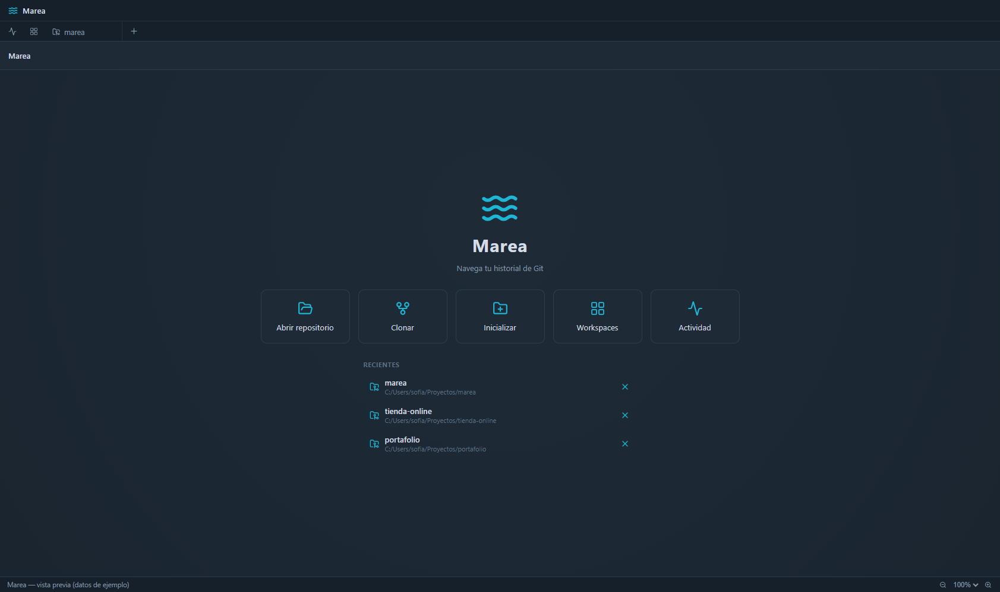

De arriba abajo:

- El **logo** y el nombre **Marea**.
- Cinco botones grandes: **Abrir repositorio**, **Clonar**, **Inicializar**,
  **Workspaces** y **Actividad**.
- La lista de **Recientes**: los repositorios que abriste últimamente, para
  volver a ellos con un solo clic.

Los tres primeros botones son las tres formas de empezar a trabajar:

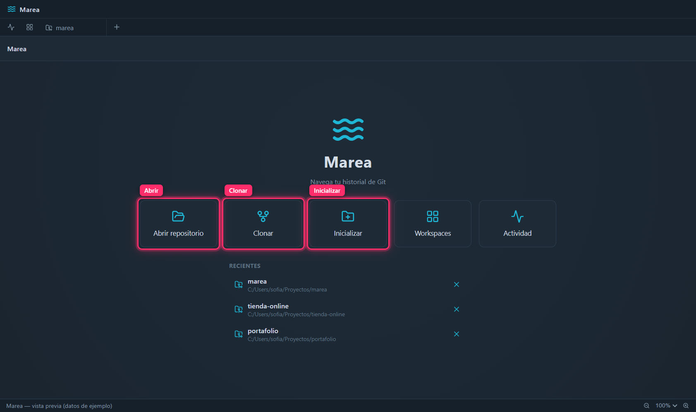

---

## 5. Abrir, clonar o crear un repositorio

### 5.1. Abrir un repositorio que ya tienes en el ordenador

1. En la bienvenida, pulsa **Abrir repositorio**.
2. Se abre el explorador de archivos del sistema. **Busca y selecciona la
   carpeta** de tu proyecto (la carpeta que contiene la subcarpeta oculta
   `.git`).
3. Pulsa **Seleccionar carpeta**. Marea abre el repositorio y muestra su
   historial.

### 5.2. Clonar (descargar) un repositorio desde internet

«Clonar» es **descargar** una copia de un repositorio que está en un servidor
(por ejemplo, GitHub) a tu ordenador.

1. En la bienvenida, pulsa **Clonar**.
2. Aparece una ventana pidiendo la **URL del repositorio**:

   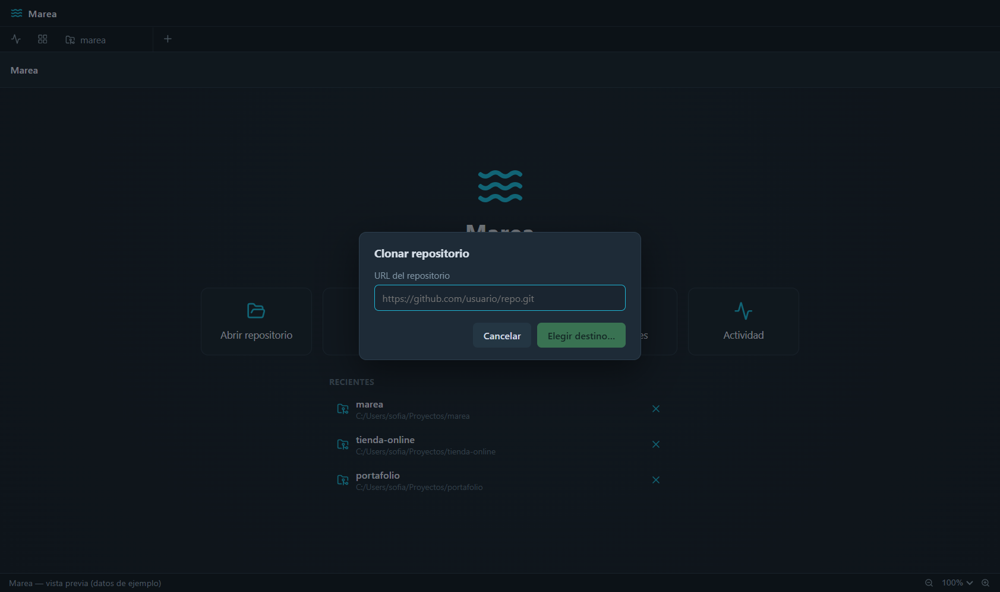

3. Pega la dirección del repositorio, por ejemplo
   `https://github.com/usuario/proyecto.git`. Esa dirección la copias desde la
   página del proyecto (botón verde **Code** en GitHub).
4. Pulsa **Elegir destino…** y selecciona en qué **carpeta** de tu ordenador se
   guardará.
5. Marea descarga el proyecto y lo abre automáticamente. Verás el aviso
   «Repositorio clonado».

### 5.3. Inicializar (crear) un repositorio nuevo

Si tienes una carpeta con archivos pero **todavía no** es un repositorio de Git:

1. En la bienvenida, pulsa **Inicializar**.
2. Elige la **carpeta** que quieres convertir en repositorio.
3. Marea ejecuta la creación y abre el repositorio, ya listo para hacer tu
   primer commit.

### 5.4. Volver a un repositorio reciente

En la lista **Recientes**, haz clic en cualquier fila para abrirlo de nuevo. La
**✕** de la derecha lo quita de la lista (no borra nada de tu disco).

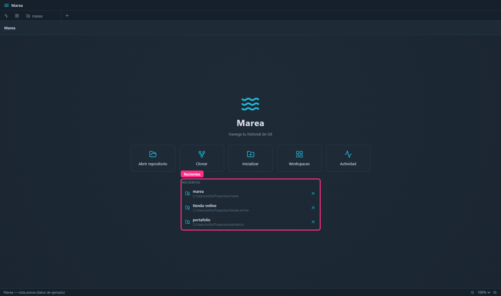

---

## 6. Conoce la ventana principal

Cuando abres un repositorio, la ventana se organiza en estas zonas:

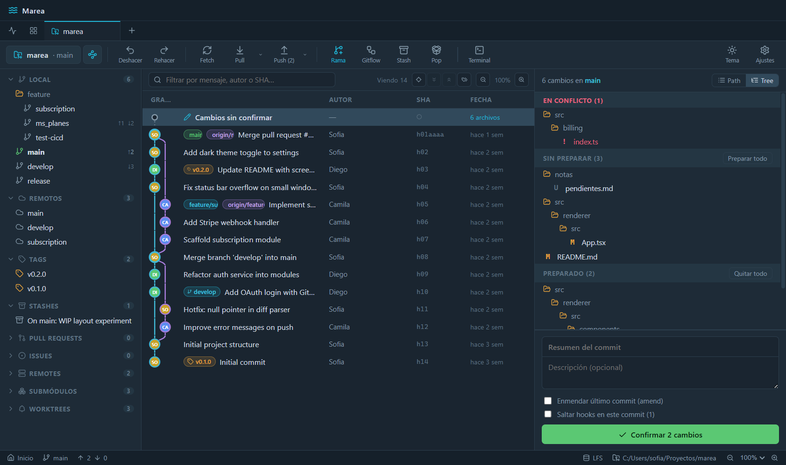

- **Barra de título** (arriba del todo): el nombre **Marea** y los botones de la
  ventana.
- **Pestañas de repositorios** (debajo): cada repositorio abierto es una
  pestaña. A la izquierda están el botón de **Actividad** y las cuatro
  cuadrículas (**Workspaces**).
- **Barra de herramientas**: los botones de acción más usados.
- **Panel izquierdo** (barra lateral): ramas, remotos, tags, stashes, pull
  requests, issues, submódulos y worktrees.
- **Panel central**: normalmente el **grafo de commits**; según lo que
  selecciones, cambia a un diff, una comparación, un pull request, etc.
- **Panel derecho**: tus **cambios sin confirmar** o el **detalle** del commit
  que elijas.
- **Barra de estado** (abajo del todo): rama actual, contadores, ruta del repo y
  zoom.

### La barra de herramientas al detalle

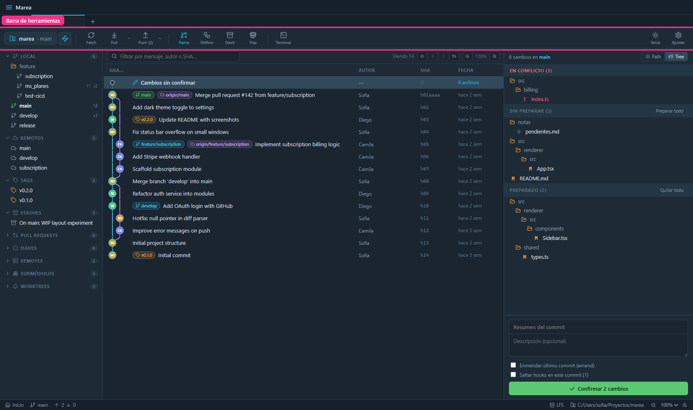

De izquierda a derecha:

- **marea · main**: nombre del repo y rama actual.
- Botón de **objetivo de merge** (icono de ramas) — ver [sección 11](#11-ramas).
- **Deshacer / Rehacer** *(reservado para una versión futura)*.
- **Fetch** · **Pull** · **Push**: sincronizar con el servidor (sección 12).
- **Rama**: crear una rama nueva.
- **Gitflow**: flujo de features/releases/hotfixes (sección 25).
- **Stash** y **Pop**: guardar y recuperar cambios «en un cajón» (sección 14).
- **Terminal**: abre una consola dentro del repo (sección 24).
- **Tema**: cambia entre claro y oscuro.
- **Ajustes**: preferencias de la aplicación (sección 28).

### La barra de estado

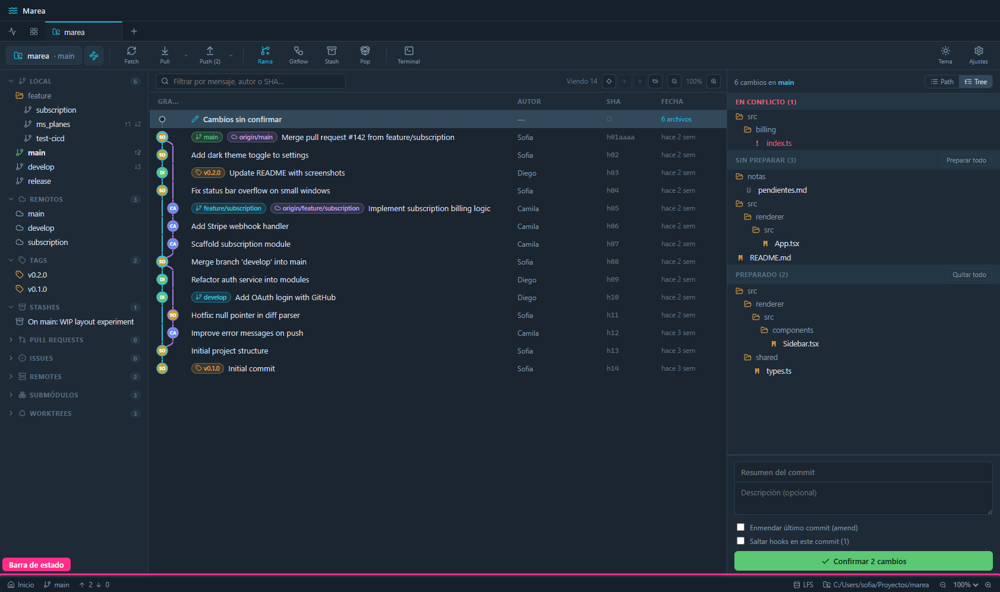

- **Inicio**: cierra el repo y vuelve a la bienvenida.
- **Rama actual** y contadores **↑ / ↓** (commits por enviar / por recibir).
- **LFS**: aparece si el repo usa Git LFS (archivos grandes).
- **Ruta** del repositorio en tu disco.
- **Zoom** de la interfaz (con los botones **–** / **+** o el desplegable).

---

## 7. El grafo de commits (tu historial)

El **grafo** es el corazón de Marea. Cada fila es un **commit** (una foto
guardada). Las líneas de colores a la izquierda muestran cómo se ramifica y se
junta el trabajo.

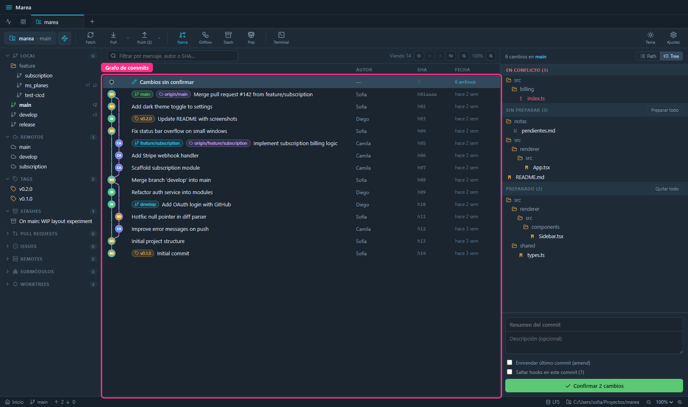

En cada fila ves: el **dibujo del grafo**, el **mensaje** del commit (con las
etiquetas de rama/tag en colores), el **autor**, el **SHA** (identificador
corto) y la **fecha**. La primera fila, **«Cambios sin confirmar»**, representa
tu trabajo actual todavía sin guardar.

Cada punto del grafo (el **nodo** del commit) no es un simple círculo: es el
**avatar del autor**, un pequeño círculo con sus **iniciales**. Cada persona
conserva **siempre el mismo color** en todo el historial y el nodo lleva además
un **anillo del color de la rama**, así que de un vistazo ves **quién** hizo
cada commit y **en qué rama** encaja, sin tener que leer nombre por nombre. Si
dejas el cursor encima de la fila, Marea te muestra el **nombre y el correo**
completos del autor.

### 7.1. Buscar y filtrar

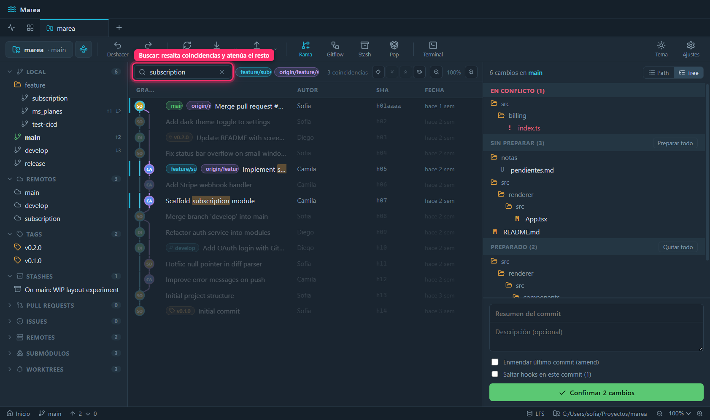

1. Escribe en la caja **«Filtrar por mensaje, autor o SHA…»**.
2. El grafo **no se recorta**: se conserva completo para que no pierdas el
   contexto de dónde encaja cada cosa. Los commits que **coinciden** se
   **resaltan** (con una **barra de color a la izquierda** y el texto encontrado
   subrayado en amarillo) y **todos los demás se atenúan** (se ven más
   **pálidos**, incluidos sus avatares). Así distingues al instante lo que
   buscas del resto.
3. Arriba a la derecha se indica cuántas **coincidencias** hay. Si la primera
   queda fuera de la vista, Marea **centra** el grafo en ella automáticamente.
4. Si no hay ninguna coincidencia entre los commits ya cargados, Marea **busca
   en el resto del historial** y muestra solo esos resultados.
5. Pulsa **Esc** o la **✕** para limpiar la búsqueda y volver a ver el grafo
   completo con normalidad.

> Atajo: **Ctrl + Alt + F** pone el cursor en la caja de búsqueda.

### 7.2. Zoom del grafo

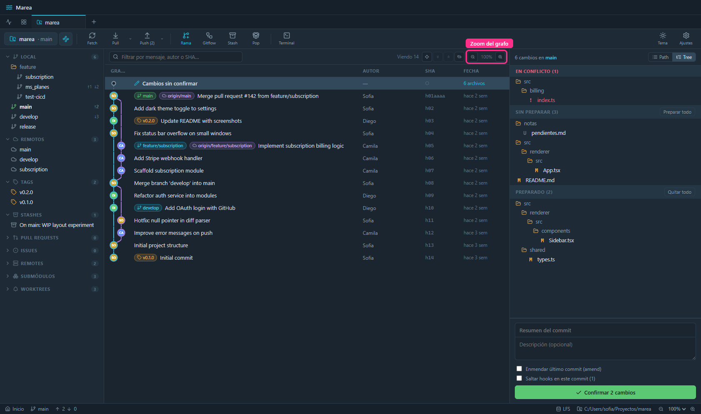

Usa los botones **–** / **+** (o **Ctrl + rueda del ratón**) para agrandar o
achicar el grafo.

### 7.3. Navegar por el historial

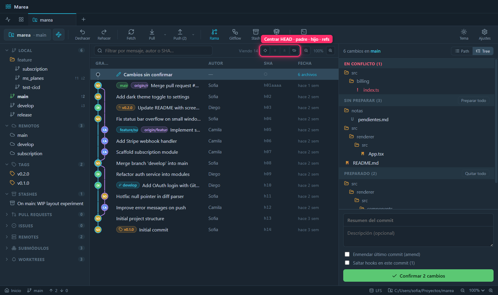

- **Diana** (centrar en HEAD): salta al commit donde estás parado.
- **Flechas**: ir al commit **padre** o **hijo** del seleccionado.
- **Etiquetas**: mostrar u ocultar las etiquetas de ramas y tags para ganar
  espacio.

También puedes **seleccionar varios commits** con **Ctrl + clic** (sueltos) o
**Shift + clic** (un rango).

### 7.4. Menú del commit (clic derecho)

**Haz clic derecho** sobre cualquier commit para ver todo lo que puedes hacer
con él:

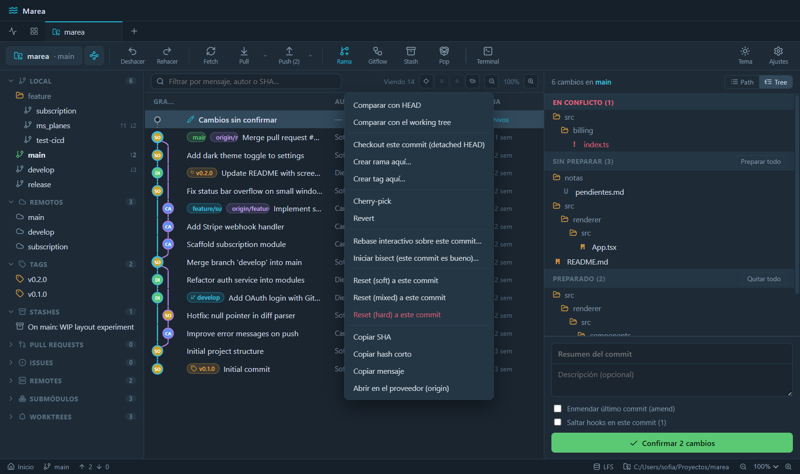

- **Comparar** con HEAD o con tu trabajo actual.
- **Checkout** de ese commit (te lleva a esa foto exacta).
- **Crear rama aquí** o **Crear tag aquí**.
- **Cherry-pick** (copiar ese commit a tu rama) y **Revert** (deshacerlo con un
  commit nuevo).
- **Rebase interactivo** e **iniciar bisect** (secciones 18 y 26).
- **Reset** (soft / mixed / hard) para mover la rama a ese commit.
- **Copiar** el SHA, el hash corto o el mensaje.
- **Abrir en el proveedor** (ver el commit en GitHub/GitLab).

---

## 8. Ver un commit por dentro

**Haz clic** (izquierdo) sobre un commit del grafo. En el **panel derecho**
aparece su **detalle**: los archivos que cambió.

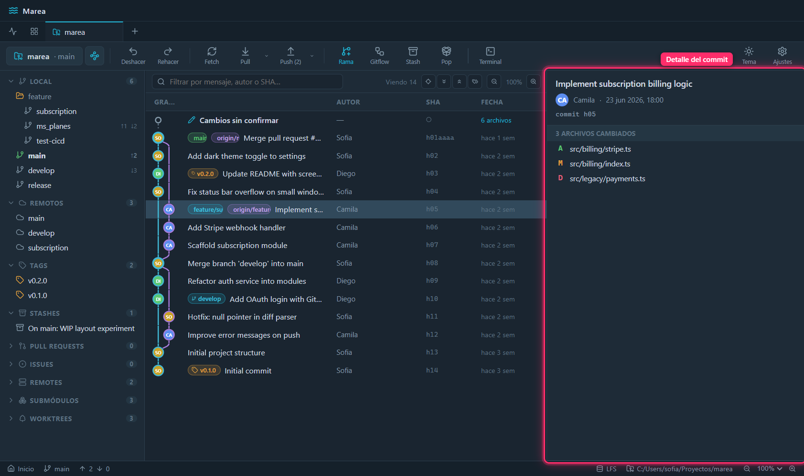

**Haz clic en un archivo** de esa lista para ver, en el panel central, **qué
líneas se añadieron o se quitaron** en ese commit:

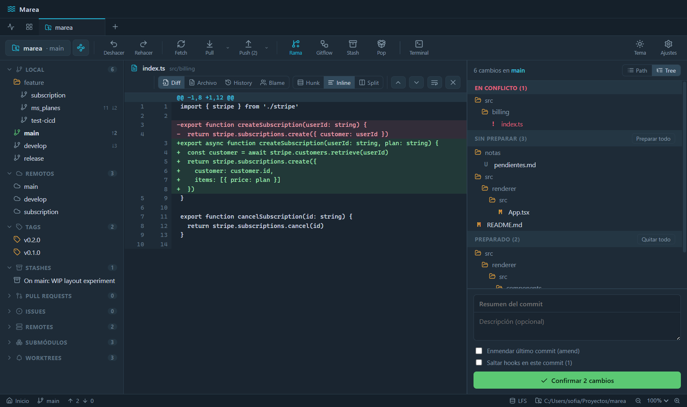

Las líneas **verdes** se añadieron; las **rojas** se eliminaron. Los números de
la izquierda son la numeración antigua y la nueva.

---

## 9. Guardar tu trabajo: cambios y commits

Cuando editas archivos del proyecto, Marea los detecta y los muestra en el
**panel derecho** bajo el título **«N cambios en <rama>»**. Es la pantalla donde
harás tus **commits**.

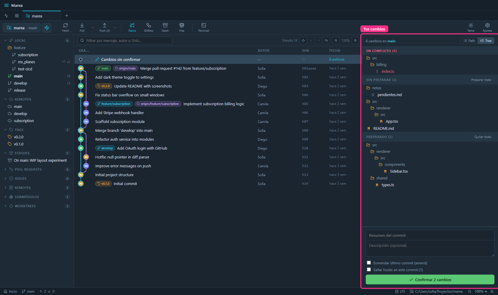

Los cambios se agrupan en tres bloques:

- **En conflicto**: archivos con choques que hay que resolver (sección 17).
- **Sin preparar**: cambios que **aún no** entrarán en el commit.
- **Preparado**: cambios que **sí** entrarán en el commit.

Arriba a la derecha, **Path / Tree** cambia entre ver la lista de archivos plana
o como árbol de carpetas.

### 9.1. Preparar (stage) y quitar

«Preparar» un archivo es decir «este cambio entra en el próximo commit».

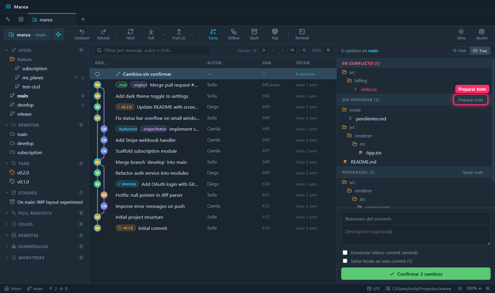

- Pasa el ratón por encima de un archivo **sin preparar**: aparecen un **+**
  (preparar) y una **↩** (descartar el cambio).
- El **+** sube el archivo al bloque **Preparado**.
- En un archivo **preparado**, el **–** lo devuelve a «Sin preparar».
- **Preparar todo** / **Quitar todo** hacen lo mismo con todos a la vez.

> **Descartar** (↩) **borra** los cambios de ese archivo de forma permanente.
> Úsalo con cuidado.

### 9.2. Escribir y confirmar el commit

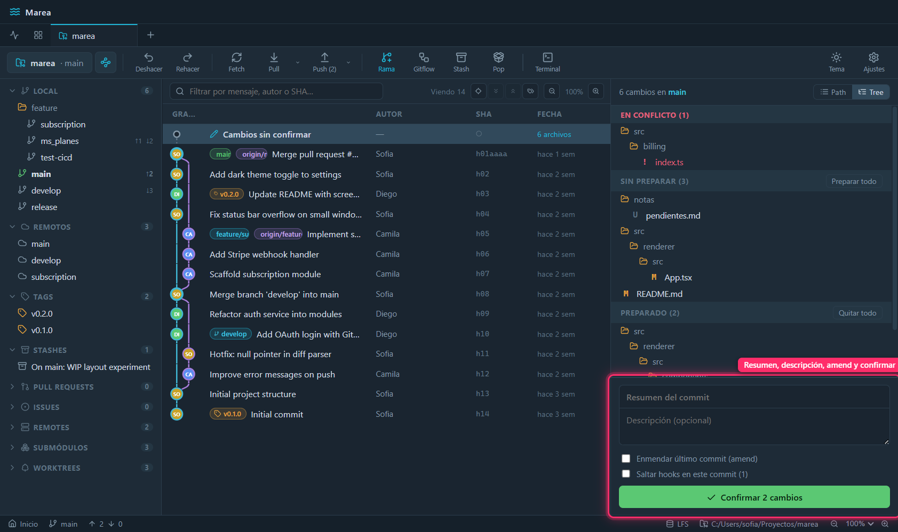

1. Escribe un **Resumen del commit** (obligatorio): una frase corta que diga qué
   hiciste, p. ej. *«Añade botón de tema oscuro»*.
2. Si quieres, añade una **Descripción** más larga debajo.
3. Opciones:
   - **Enmendar último commit (amend)**: en vez de crear un commit nuevo,
     modifica el último. Útil si te olvidaste de algo.
   - **Saltar hooks en este commit**: aparece si el repo tiene *hooks* (scripts
     automáticos); permite saltártelos esta vez.
4. Pulsa el botón verde **Confirmar N cambios**. Si no habías preparado nada, el
   botón dirá **Preparar y confirmar** y preparará todo por ti antes de guardar.

---

## 10. El visor de diferencias (diff)

Cada vez que seleccionas un archivo (en tus cambios o en un commit), el panel
central muestra su **diff**: exactamente qué cambió.

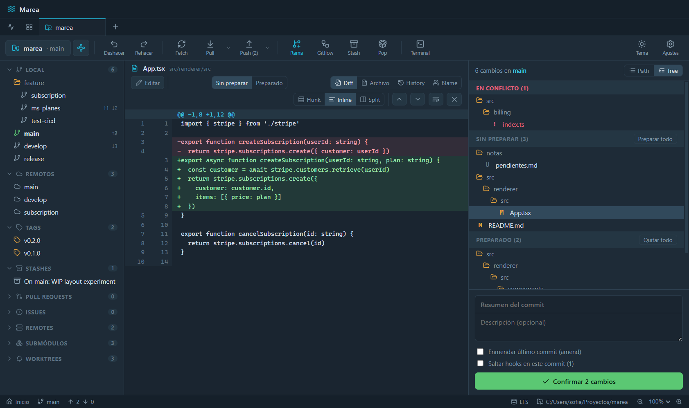

- Fondo **verde** con `+`: líneas añadidas.
- Fondo **rojo** con `-`: líneas eliminadas.
- Las dos columnas de números son la numeración **vieja** y **nueva**.
- Los bloques de cambios se llaman **hunks**. En tus cambios sin confirmar
  puedes preparar o descartar **hunk por hunk** o incluso **línea a línea**, para
  hacer commits muy precisos.

---

## 11. Ramas

Las ramas te dejan trabajar en algo sin tocar la línea principal. En el **panel
izquierdo**, la sección **Local** lista tus ramas; **Remotos** las que están en
el servidor.

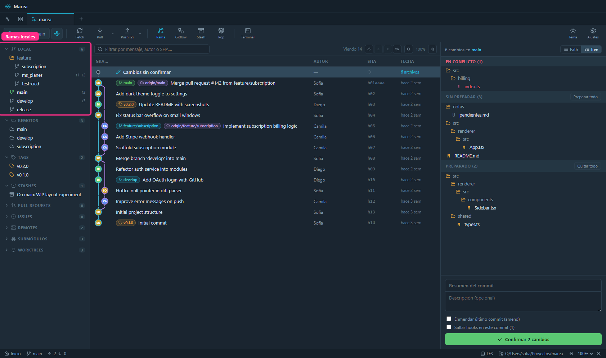

Los números **↑ / ↓** al lado de una rama indican cuántos commits tiene por
**enviar** o por **recibir** respecto a su copia remota. La rama actual está
resaltada.

### 11.1. Crear una rama nueva

1. Pulsa **Rama** en la barra de herramientas (o **Ctrl + B**).
2. Escribe el nombre de la rama:

   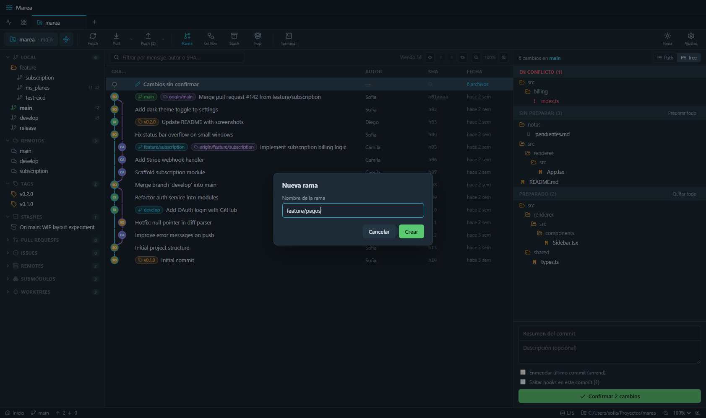

3. Pulsa **Crear**. Te cambia automáticamente a la rama nueva.

> También puedes crear una rama **desde un commit concreto**: clic derecho en el
> commit → **Crear rama aquí…**.

### 11.2. Menú de una rama (clic derecho)

**Haz clic derecho** sobre una rama de la barra lateral:

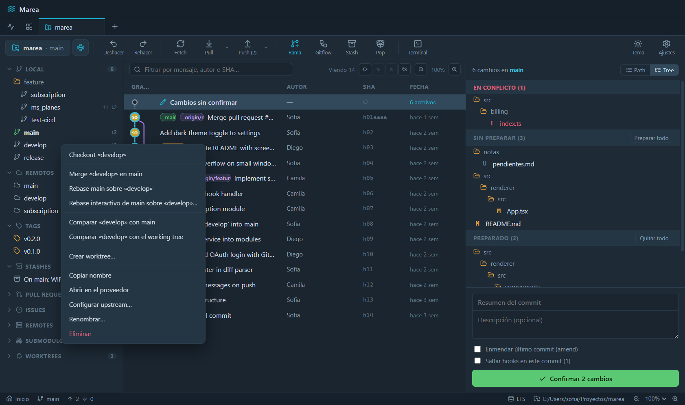

- **Checkout**: cambiarte a esa rama (también con doble clic).
- **Merge «rama» en <actual>**: traer el trabajo de esa rama a la tuya.
- **Rebase** y **Rebase interactivo** (sección 18).
- **Comparar** con la rama actual o con tu trabajo.
- **Crear worktree** (sección 20).
- **Configurar upstream**, **Renombrar** y **Eliminar**.
- En ramas remotas, además: **Abrir en el proveedor** y **Eliminar del remoto**.

> **Arrastrar y soltar:** puedes arrastrar una rama sobre otra rama o sobre un
> commit para hacer merge/rebase; Marea te ofrecerá las opciones al soltar.

### 11.3. El «objetivo de merge»

El botón con icono de ramas (junto al nombre del repo) muestra cómo va tu rama
respecto a su rama **objetivo** (por ejemplo, `develop`):

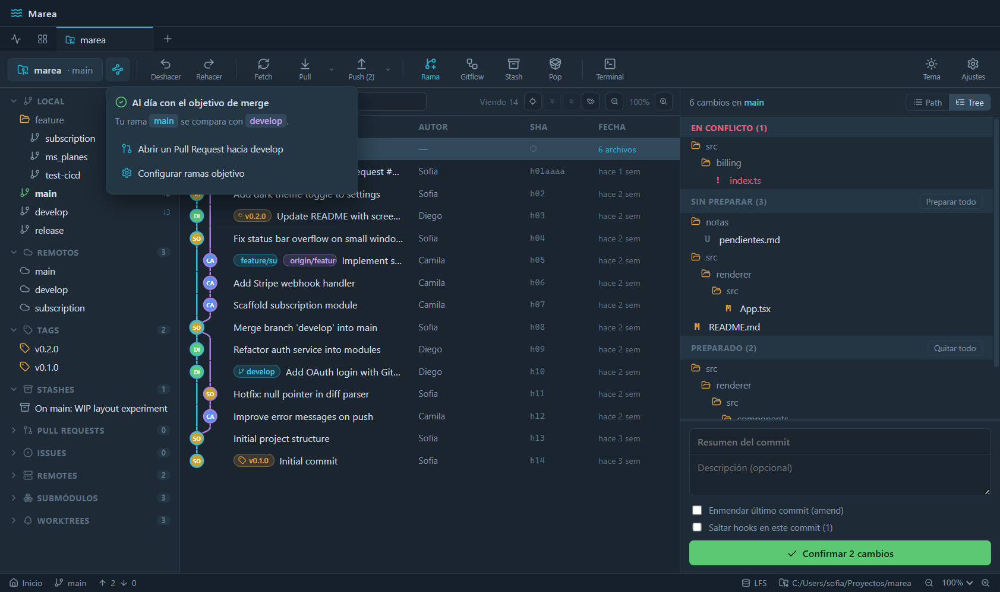

Desde ahí puedes **abrir un Pull Request** hacia esa rama o **configurar** cuál
es la rama objetivo.

---

## 12. Sincronizar con el servidor: Fetch, Pull y Push

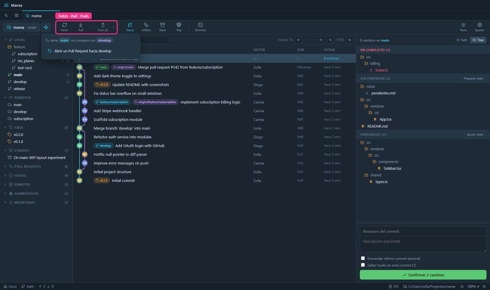

- **Fetch**: trae las novedades del remoto **sin** mezclarlas con tu trabajo.
  Ideal para «ver qué hay de nuevo» sin riesgo. Marea limpia además las ramas
  remotas que ya no existen (*prune*).
- **Pull**: trae **y** mezcla. El número entre paréntesis es cuántos commits
  tienes por recibir.
- **Push**: envía tus commits al remoto. El número es cuántos tienes por enviar.
  Si la rama es nueva, el botón dirá **Publicar**.

### 12.1. Opciones de Pull

Pulsa la **flechita ▾** junto a *Pull*:

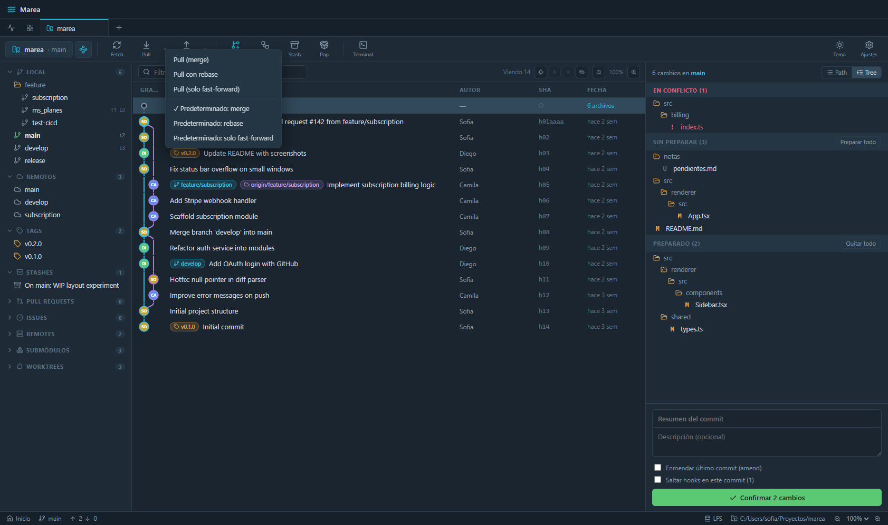

- **Pull (merge)**: crea un commit de mezcla si hace falta.
- **Pull con rebase**: reordena tus commits encima de los del remoto (historial
  más limpio).
- **Pull (solo fast-forward)**: solo avanza si no hay divergencia.
- Abajo puedes fijar cuál de las tres es la **predeterminada** (la que usa el
  botón grande).

### 12.2. Opciones de Push

Pulsa la **flechita ▾** junto a *Push*:

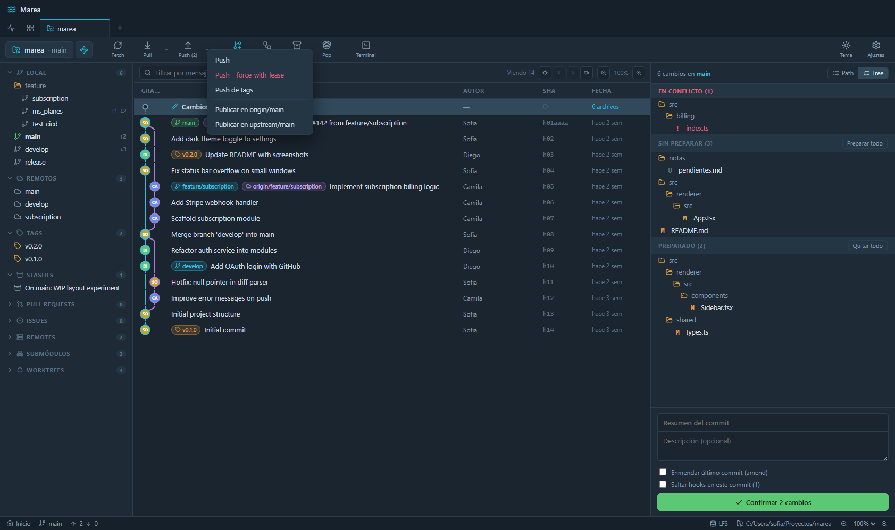

- **Push** / **Publicar en …**: lo normal.
- **Push --force-with-lease**: sobrescribe el historial remoto de forma
  **segura** (aborta si otra persona empujó antes). Pide confirmación. Úsalo solo
  si sabes lo que haces.
- **Push de tags**: envía tus etiquetas.

---

## 13. Gestionar remotos

Un **remoto** es la dirección de una copia del repo en un servidor. En la barra
lateral, abre la sección **Remotes** y **haz clic derecho** sobre uno:

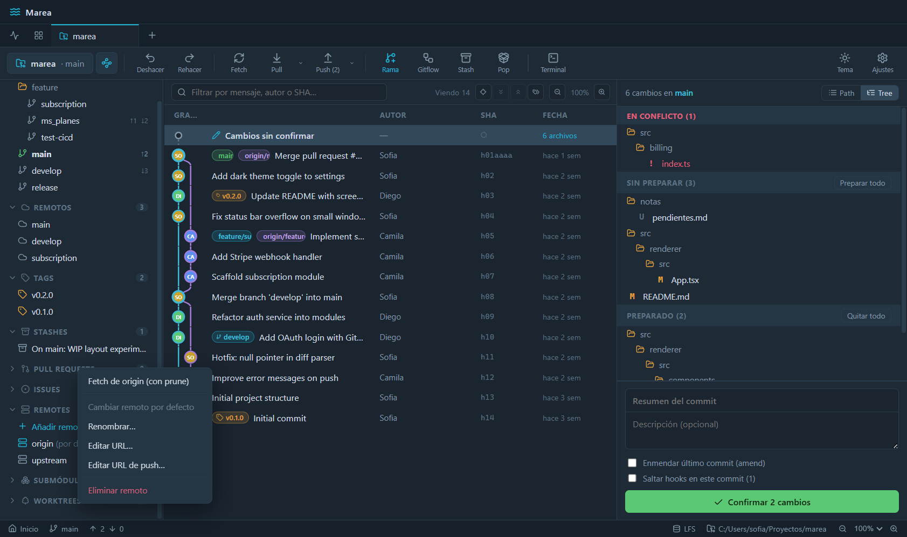

- **Fetch de <remoto>**: traer novedades solo de ese remoto.
- **Cambiar remoto por defecto**.
- **Renombrar…**, **Editar URL…**, **Editar URL de push…**.
- **Eliminar remoto**.

Para **añadir** uno, usa **+ Añadir remoto** al principio de la sección: te pide
un **nombre** (p. ej. `origin`) y luego la **URL**.

---

## 14. Stash: guardar cambios «en un cajón»

Un **stash** guarda tus cambios sin confirmar en un lado para dejar la carpeta
limpia, y los recuperas cuando quieras. Útil si necesitas cambiar de rama con
prisa.

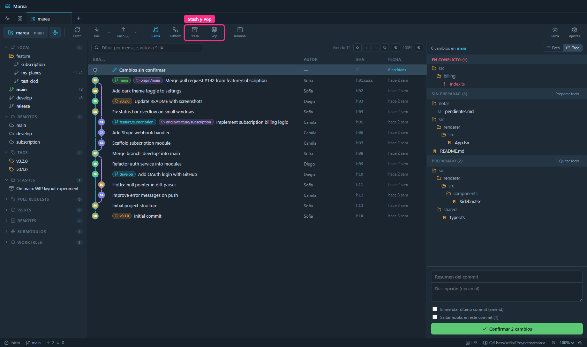

- **Stash**: guarda tus cambios actuales en el cajón (te deja escribir un nombre).
- **Pop**: recupera el último stash y lo quita del cajón.

Los stashes guardados aparecen en la sección **Stashes** de la barra lateral.
**Clic derecho** sobre uno para ver todas sus opciones:

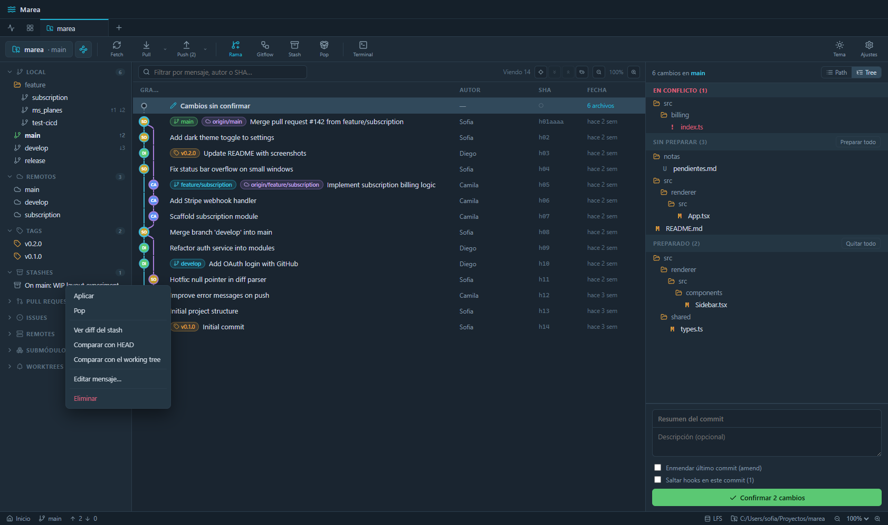

- **Aplicar** (recuperar sin borrarlo del cajón) o **Pop** (recuperar y borrar).
- **Ver diff del stash** y comparar con HEAD o con tu trabajo.
- **Editar mensaje…** y **Eliminar**.

---

## 15. Tags (etiquetas de versión)

Un **tag** es una marca con nombre sobre un commit, normalmente para señalar una
**versión** (p. ej. `v1.0.0`). Se listan en la sección **Tags**. **Clic
derecho** sobre uno:

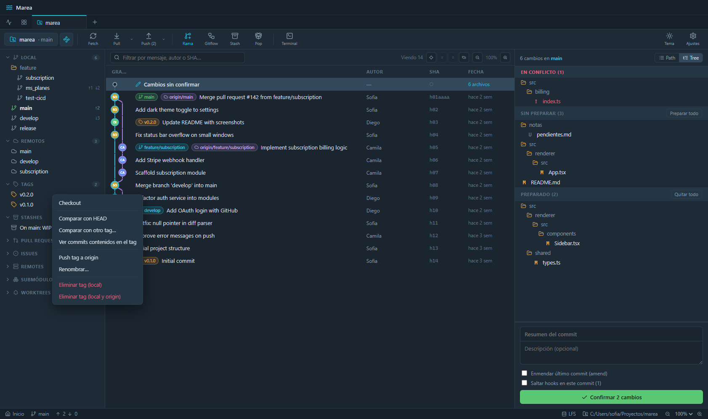

- **Checkout**: ir al commit del tag.
- **Comparar con HEAD** o con **otro tag**.
- **Ver commits contenidos en el tag**.
- **Push tag a <remoto>**: publicarlo.
- **Renombrar…** (Marea recrea el tag y ofrece actualizar el remoto).
- **Eliminar** (solo local, o también en el remoto).

Para **crear** un tag: clic derecho en un commit del grafo → **Crear tag aquí…**.

---

## 16. Deshacer y reescribir: reset, cherry-pick y revert

Todas estas acciones están en el **menú del commit** (clic derecho en el grafo,
[sección 7.4](#74-menú-del-commit-clic-derecho)):

- **Reset (soft)**: mueve la rama a ese commit **conservando** tus cambios
  preparados.
- **Reset (mixed)**: mueve la rama y deja los cambios **sin preparar**.
- **Reset (hard)**: mueve la rama y **descarta** todo lo posterior. ⚠️ Pierdes
  trabajo; pide confirmación.
- **Cherry-pick**: copia **ese** commit encima de tu rama actual.
- **Revert**: crea un commit **nuevo** que deshace lo que hizo ese commit (sin
  borrar historia; es la forma segura de «dar marcha atrás»).

---

## 17. Resolver conflictos

Un **conflicto** ocurre cuando dos cambios tocan las mismas líneas y Git no sabe
cuál conservar (típico al hacer merge o rebase). Marea te avisa con una **barra
de operación** arriba:

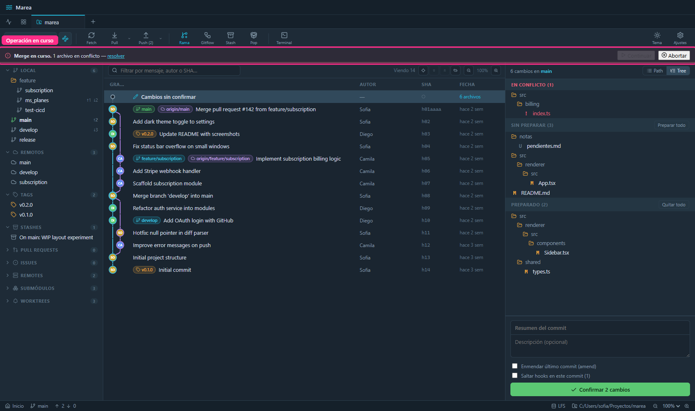

Ahí ves qué operación está en curso (merge, rebase…), cuántos archivos están en
conflicto y los botones **Continuar** y **Abortar** (cancelar y volver atrás).

Pulsa **resolver** (o haz clic en el archivo en conflicto) para abrir el **editor
de conflictos a tres zonas**:

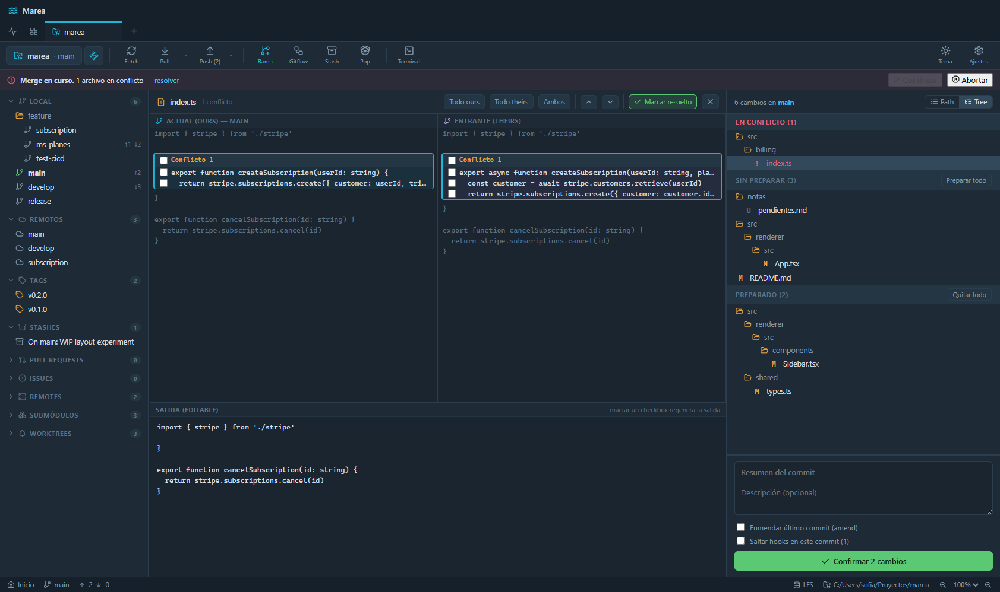

- Izquierda: **ACTUAL (OURS)** — tu versión.
- Derecha: **ENTRANTE (THEIRS)** — la versión que llega.
- Abajo: **SALIDA (EDITABLE)** — el resultado final, que puedes editar a mano.

Cómo resolverlo:

1. Marca las **casillas** de las líneas que quieres conservar de cada lado. La
   salida se va formando abajo.
2. Los botones **Todo ours** / **Todo theirs** / **Ambos** aplican una opción a
   todo el conflicto de golpe.
3. Usa las flechas **▲ ▼** para saltar entre conflictos si hay varios.
4. Cuando la **salida** te convenza, pulsa **Marcar resuelto**.
5. Repite con cada archivo y, al final, pulsa **Continuar** en la barra superior
   para terminar la operación.

---

## 18. Rebase interactivo

El **rebase interactivo** te deja **reordenar, combinar o reescribir** varios
commits de golpe. Ábrelo desde el menú de un commit o de una rama → **Rebase
interactivo…**.

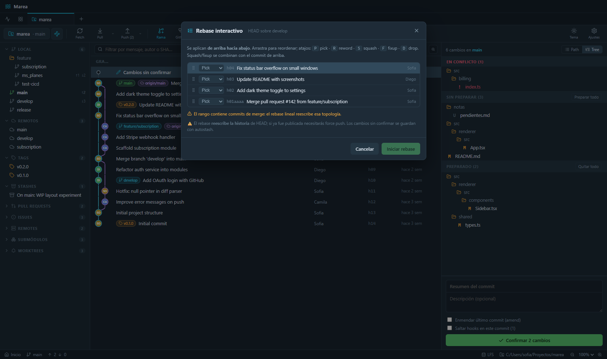

- Cada fila es un commit. Se aplican **de arriba hacia abajo**.
- En cada uno eliges una acción en el desplegable:
  - **Pick**: mantenerlo tal cual.
  - **Reword**: mantenerlo pero cambiar su mensaje.
  - **Squash / Fixup**: **fundirlo** con el commit de arriba (fixup descarta su
    mensaje).
  - **Drop**: eliminarlo.
- **Arrastra** las filas (icono ⁞⁞ a la izquierda) para **reordenarlas**.
- Atajos: **P**, **R**, **S**, **F**, **D**.
- Pulsa **Iniciar rebase**. Los avisos amarillos advierten si reescribirás
  historia ya publicada (necesitarás *force push*).

---

## 19. Comparar y auditar: comparar, historial y blame

### 19.1. Comparar dos ramas, tags o commits

Desde el menú de una rama, un tag o dos commits seleccionados → **Comparar…**.
El panel central muestra **todas las diferencias** entre ambos lados:

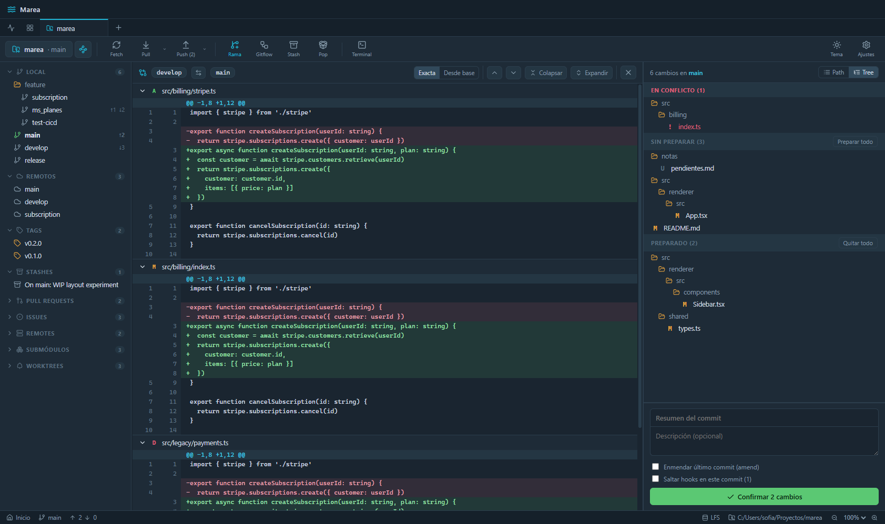

Arriba puedes intercambiar los lados (**⇄**), elegir **Exacta** o **Desde base**,
y **Colapsar / Expandir** los archivos.

### 19.2. Historial de un archivo

Clic derecho en un archivo (o carpeta) → **Historial del archivo**. Verás todos
los commits que tocaron ese archivo, siguiendo incluso sus **renombrados**:

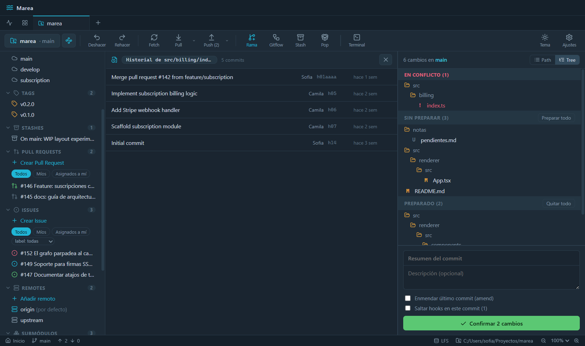

### 19.3. Blame (quién escribió cada línea)

Clic derecho en un archivo → **Blame**. Cada línea muestra **quién** la escribió
y en **qué commit**:

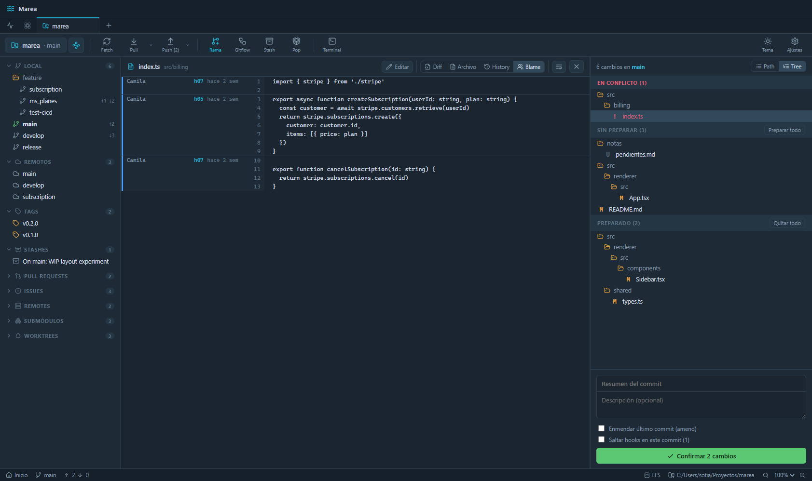

Arriba puedes alternar entre **Diff**, **Archivo**, **History** y **Blame** del
mismo archivo, y **Editar** para abrirlo en tu editor externo.

---

## 20. Worktrees (varias carpetas del mismo repo)

Un **worktree** es una **segunda carpeta** de trabajo del mismo repositorio, con
otra rama activa. Así puedes tener `main` y una `feature` abiertas a la vez en
carpetas distintas, sin andar cambiando de rama.

Abre la sección **Worktrees** en la barra lateral y **haz clic derecho** sobre
uno:

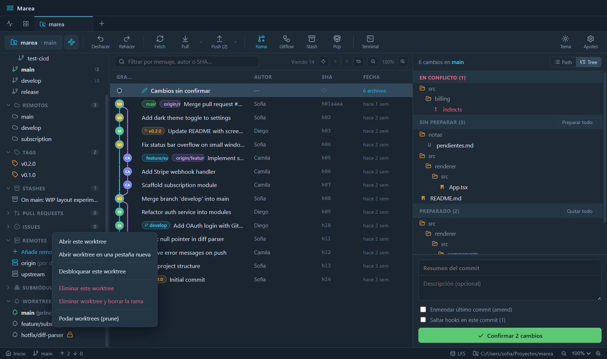

- **Abrir este worktree** (o en una pestaña nueva).
- **Bloquear / Desbloquear** (evita que se elimine por error).
- **Eliminar** el worktree, con opción de **borrar también la rama**.
- **Podar (prune)**: limpia los worktrees que ya no existen en disco.

Para **crear** uno: clic derecho en una rama → **Crear worktree…**, o arrastra la
rama a la sección Worktrees.

---

## 21. Submódulos

Un **submódulo** es otro repositorio de Git metido dentro del tuyo (por ejemplo,
una librería compartida). Se listan en la sección **Submódulos**.

Si abres un repo con submódulos **sin descargar**, Marea te ofrece traerlos:

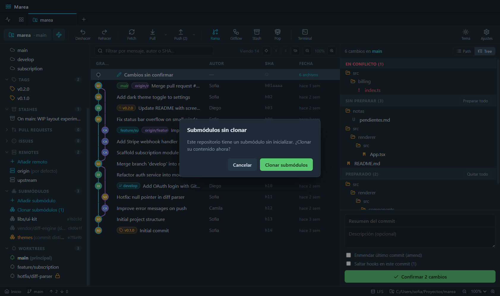

Pulsa **Clonar submódulos** para descargar su contenido, o **Cancelar** para
hacerlo más tarde.

**Clic derecho** sobre un submódulo para gestionarlo:

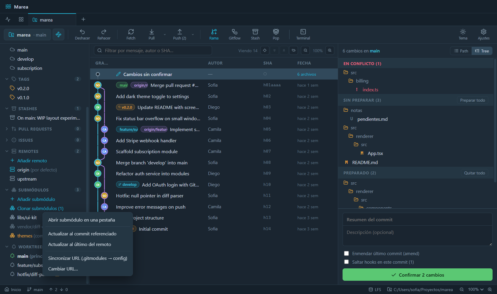

- **Abrir el submódulo en una pestaña**.
- **Inicializar** (descargar su contenido).
- **Actualizar** al commit referenciado o **al último del remoto**.
- **Sincronizar URL** y **Cambiar URL…**.

Con **+ Añadir submódulo** al principio de la sección puedes agregar uno nuevo
(te pide la **URL** y la **ruta** dentro del repo).

---

## 22. Pull Requests (GitHub)

Un **Pull Request** (PR) es una propuesta para juntar tu rama en otra, que el
equipo revisa antes de aceptar. Marea trabaja con los PR de **GitHub** sin salir
de la aplicación.

> Para esto necesitas haber iniciado sesión en GitHub (normalmente a través del
> **Git Credential Manager**; ver [sección 29](#29-cuentas-y-proveedores-github-gitlab)).

Abre la sección **Pull Requests** en la barra lateral:

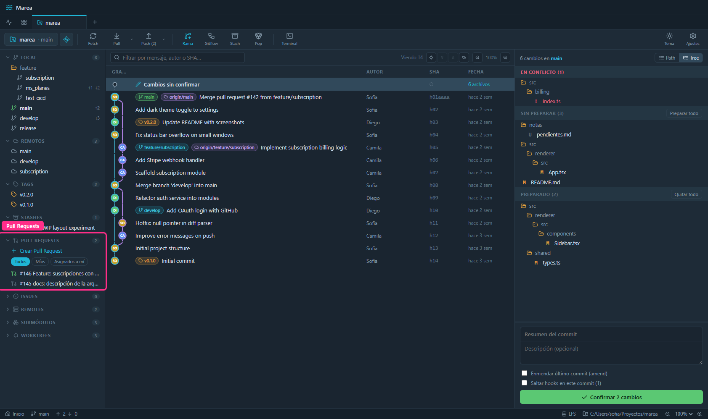

Puedes filtrar por **Todos / Míos / Asignados a mí**, y crear uno con **+ Crear
Pull Request**.

### 22.1. Crear un Pull Request

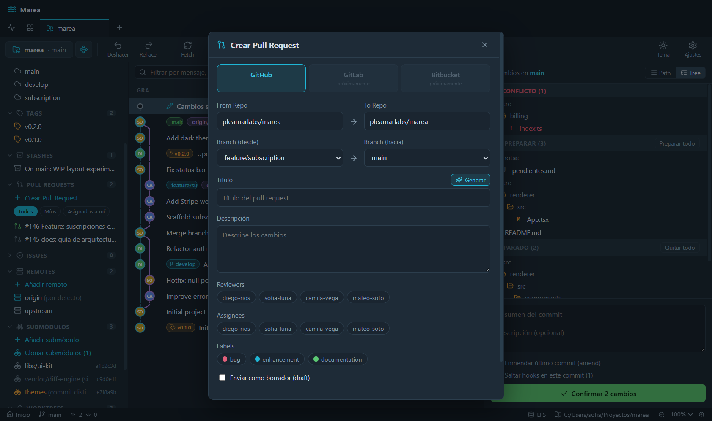

1. Elige el proveedor (**GitHub**).
2. Revisa **From** (tu rama) y **To** (la rama destino).
3. Escribe un **Título** (o pulsa **Generar** para proponer uno) y una
   **Descripción**.
4. Opcional: añade **Reviewers**, **Assignees** y **Labels**; marca **borrador
   (draft)** si aún no está listo.
5. Pulsa el botón de crear. El PR se publica en GitHub.

### 22.2. Revisar un Pull Request

Haz clic en un PR de la lista para abrir la vista de revisión:

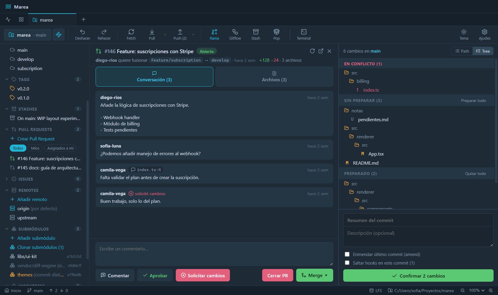

- Pestaña **Conversación**: la descripción y los comentarios.
- Pestaña **Archivos**: los cambios, archivo por archivo, donde puedes comentar
  **en una línea concreta**.
- Botones inferiores: **Comentar**, **Aprobar**, **Solicitar cambios**, **Cerrar
  PR** y **Merge** (con menú para elegir *merge commit*, *squash* o *rebase*).

---

## 23. Issues (GitHub)

Los **Issues** son tareas, errores o ideas anotadas en GitHub. Abre la sección
**Issues** en la barra lateral:

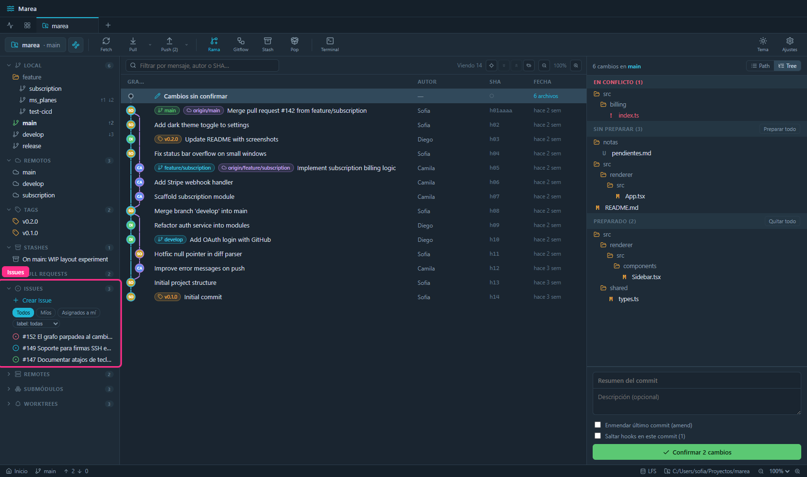

Filtra por **Todos / Míos / Asignados a mí** o por **label**, y crea uno con
**+ Crear Issue**.

### 23.1. Crear un Issue

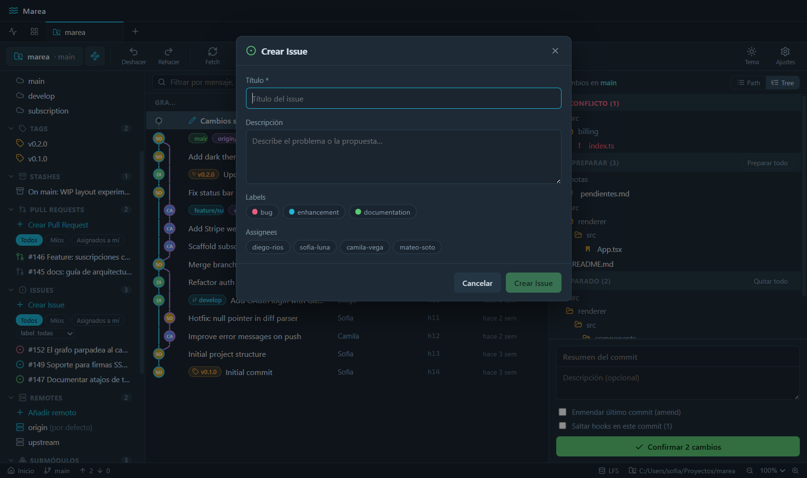

Escribe un **título** y una **descripción**, añade **labels/assignees** si
quieres, y publícalo.

### 23.2. Ver un Issue y crear una rama para él

Haz clic en un issue para abrir su detalle, con sus comentarios:

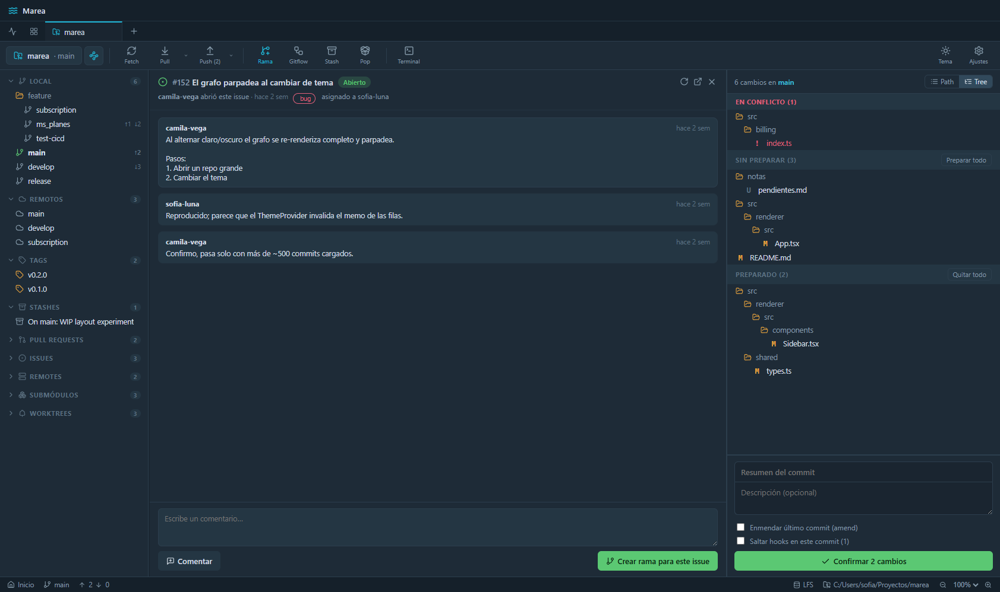

El botón **Crear rama para este issue** crea una rama con el nombre ya rellenado
(p. ej. `152-el-grafo-parpadea`) y la vincula al issue. A partir de entonces, al
hacer commit en esa rama, Marea te sugiere añadir `#152` o `Fixes #152` al
mensaje para que GitHub lo enlace (y lo cierre al mergear).

---

## 24. Terminal integrada

Si prefieres escribir comandos, Marea trae una **terminal** ya situada en la
carpeta del repositorio. Pulsa **Terminal** en la barra de herramientas (o
**Ctrl + T**):

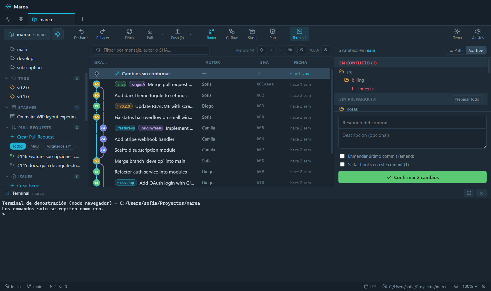

Se abre abajo, con una sesión propia por repositorio. Vuelve a pulsar el botón
para ocultarla.

---

## 25. Gitflow

**Gitflow** es una forma organizada de trabajar con ramas de **feature**,
**release** y **hotfix**. Pulsa **Gitflow** en la barra de herramientas:

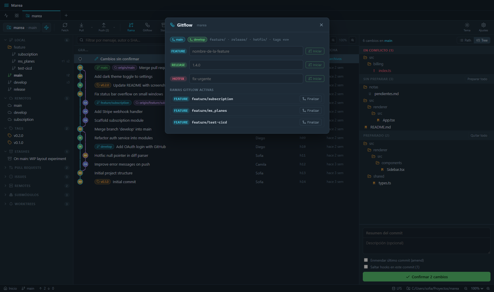

- Escribe un nombre y pulsa **Iniciar** para empezar una **Feature**, **Release**
  o **Hotfix** (Marea crea la rama con el prefijo correcto).
- En **Ramas Gitflow activas**, el botón **Finalizar** cierra la rama como manda
  el flujo (la mezcla donde corresponde y la borra).

---

## 26. Bisect: encontrar el commit que rompió algo

**Bisect** te ayuda a encontrar **qué commit** introdujo un fallo, probando
commits intermedios por descarte (búsqueda binaria).

1. Selecciona **dos commits** (Ctrl+clic): uno que sabes que funcionaba y otro
   que falla. En su menú, elige **Iniciar bisect entre estos commits…**. (O clic
   derecho en un commit bueno → **Iniciar bisect (este commit es bueno)**.)
2. Marea te sitúa en un commit intermedio y muestra una **barra de bisect**:

   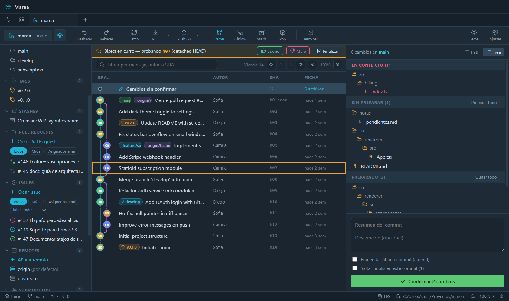

3. Prueba tu proyecto y pulsa **Bueno** o **Malo** según funcione o no.
4. Marea repite hasta señalar el **commit culpable**.
5. Pulsa **Finalizar** para terminar y volver a tu rama.

---

## 27. Firmas, hooks y plantillas (ajustes del repositorio)

Estas opciones se configuran **por repositorio**. Ábrelas desde
*Ajustes → pestaña Git → «Abrir ajustes del repositorio…»*:

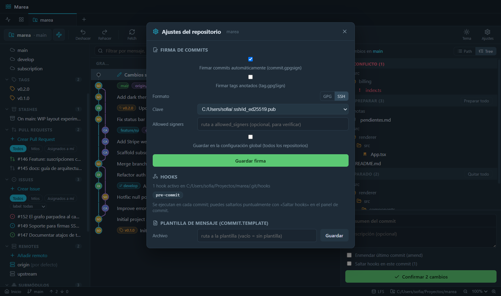

- **Firma de commits**: firmar automáticamente tus commits con **GPG** o **SSH**
  (elige el formato y la **clave**). También puedes firmar los tags.
- **Hooks**: muestra los *hooks* activos del repo (scripts que se ejecutan solos,
  p. ej. antes de cada commit). Recuerda que puedes saltarlos puntualmente con
  «Saltar hooks» en el panel de commit.
- **Plantilla de mensaje**: un archivo que precarga el mensaje al hacer commit.

---

## 28. Preferencias de la aplicación

Pulsa **Ajustes** (arriba a la derecha) o **Ctrl + ,**. El panel tiene pestañas
a la izquierda.

### General

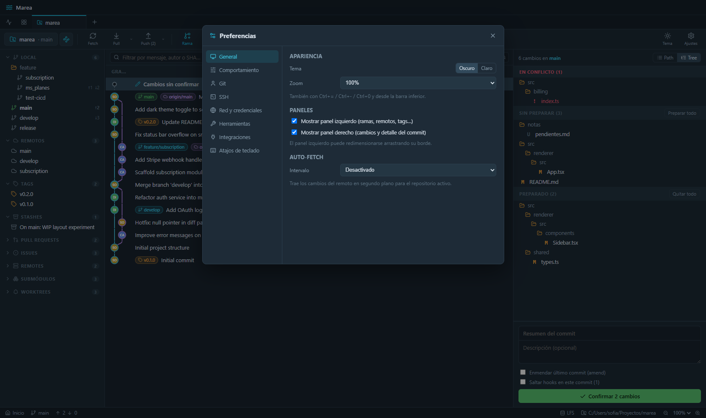

- **Tema** (oscuro/claro) y **Zoom** de la interfaz.
- **Paneles**: mostrar u ocultar el panel izquierdo y el derecho.
- **Auto-fetch**: traer novedades del remoto cada X minutos en segundo plano.

### Git

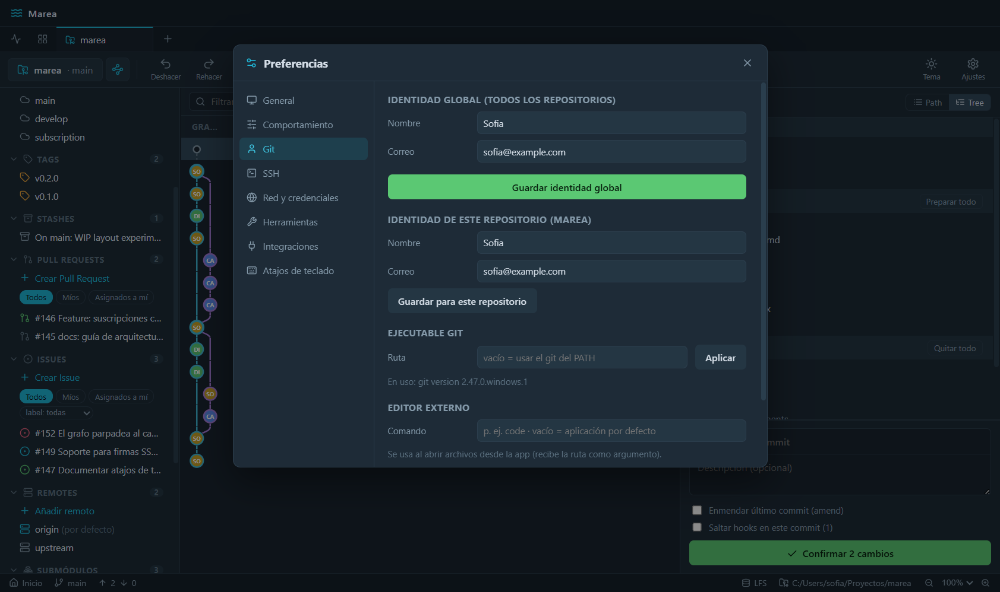

- Tu **identidad** (nombre y correo) global y por repositorio.
- La ruta del **ejecutable Git** que usa Marea.
- El **editor externo** para abrir archivos.

### Integraciones

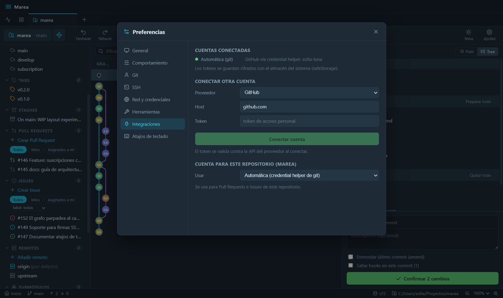

Ver la [sección 29](#29-cuentas-y-proveedores-github-gitlab).

### Atajos de teclado

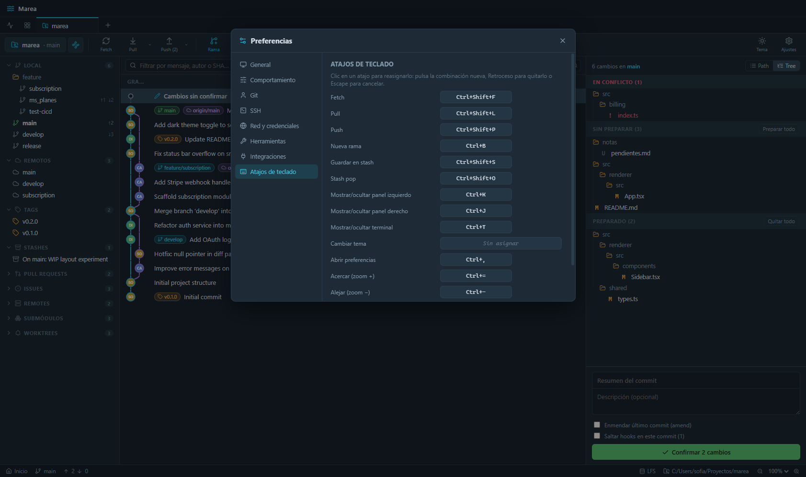

Haz clic en un atajo para **reasignarlo**: pulsa la nueva combinación,
**Retroceso** para quitarlo o **Escape** para cancelar. **Restaurar todos por
defecto** vuelve a los originales.

> Las pestañas **Comportamiento**, **SSH**, **Red y credenciales** y
> **Herramientas** permiten ajustar la estrategia de *pull*, la clave SSH, el
> proxy, el *credential helper* y las herramientas de merge/diff.

---

## 29. Cuentas y proveedores (GitHub, GitLab…)

En *Ajustes → Integraciones* gestionas las cuentas para los Pull Requests e
Issues:


- **Automática (git)**: Marea usa las credenciales que ya tiene tu sistema
  (recomendado: **Git Credential Manager**). Si iniciaste sesión al hacer un
  *push* a GitHub, normalmente ya funciona sin configurar nada.
- **Conectar otra cuenta**: elige proveedor (**GitHub**, **GitLab**…), pega un
  **token de acceso personal** y pulsa **Conectar cuenta**. El token se guarda
  **cifrado** con el almacén seguro del sistema.
- **Cuenta para este repositorio**: si trabajas con varias cuentas, elige cuál
  usar en este repo.

---

## 30. Workspaces (grupos de repositorios)

Un **workspace** es un grupo de repositorios que sueles usar juntos, para
operarlos en lote. Ábrelo con el icono de **cuadrícula** (arriba a la izquierda)
o desde la bienvenida.

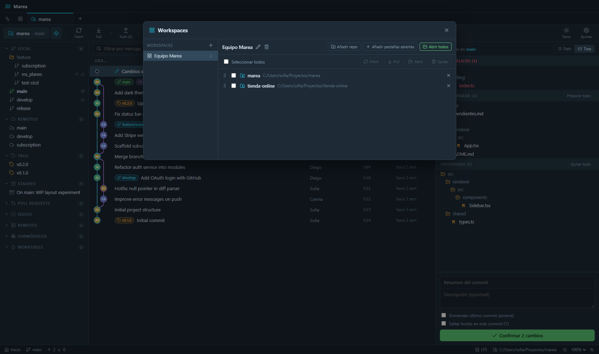

- **+** (arriba) crea un workspace nuevo.
- **Añadir repo** y **Añadir pestañas abiertas** meten repositorios en él.
- Marca varios y usa **Fetch**, **Pull**, **Abrir** o **Quitar** para actuar
  sobre todos a la vez. **Abrir todos** los abre en pestañas.

---

## 31. Actividad (todo tu trabajo en un vistazo)

La **Actividad** reúne, de **todos** tus repositorios, los Pull Requests, Issues
y cambios pendientes en un solo lugar. Ábrela con el icono de **Actividad** (arriba
a la izquierda) o desde la bienvenida.

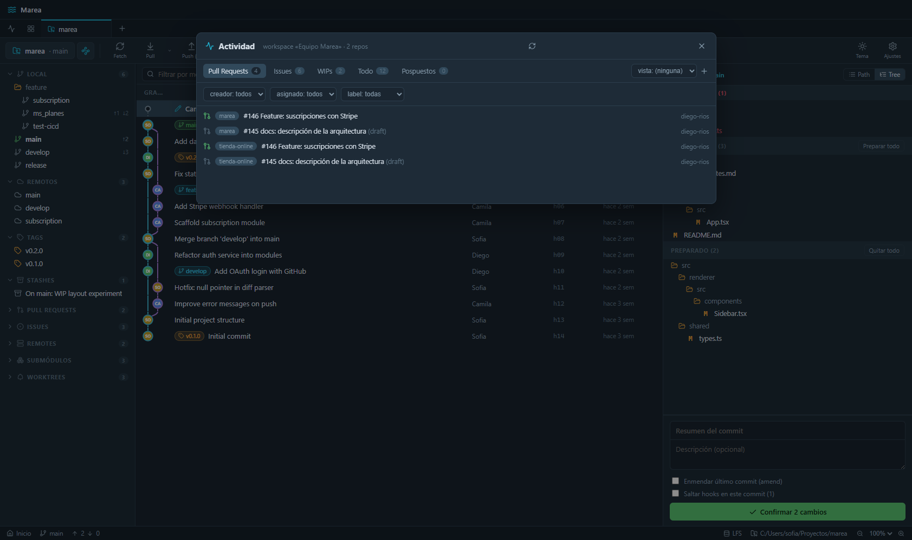

- Pestañas **Pull Requests**, **Issues**, **WIPs** (trabajo sin confirmar),
  **Todo** y **Pospuestos**.
- Filtros por **creador**, **asignado** y **label**.
- Puedes **fijar**, **posponer** o marcar como **leído** cada elemento, y guardar
  **vistas** con tus filtros favoritos.

---

## 32. Tema, zoom y paneles

- **Tema claro/oscuro**: botón **Tema** en la barra de herramientas. Así se ve el
  tema claro:

  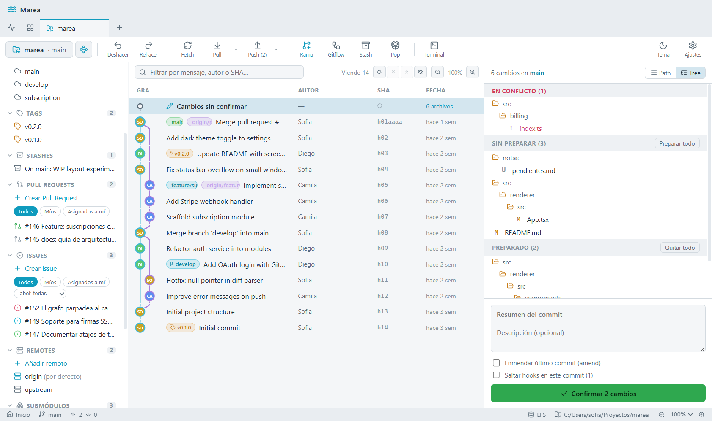

- **Zoom**: con **Ctrl + =** (acercar), **Ctrl + –** (alejar), **Ctrl + 0**
  (restablecer) o el control de la barra de estado.
- **Ocultar paneles**: en *Ajustes → General*, o con **Ctrl + K** (panel
  izquierdo) y **Ctrl + J** (panel derecho). El borde del panel izquierdo se
  **arrastra** para cambiar su ancho.

---

## 33. Pestañas: varios repositorios a la vez

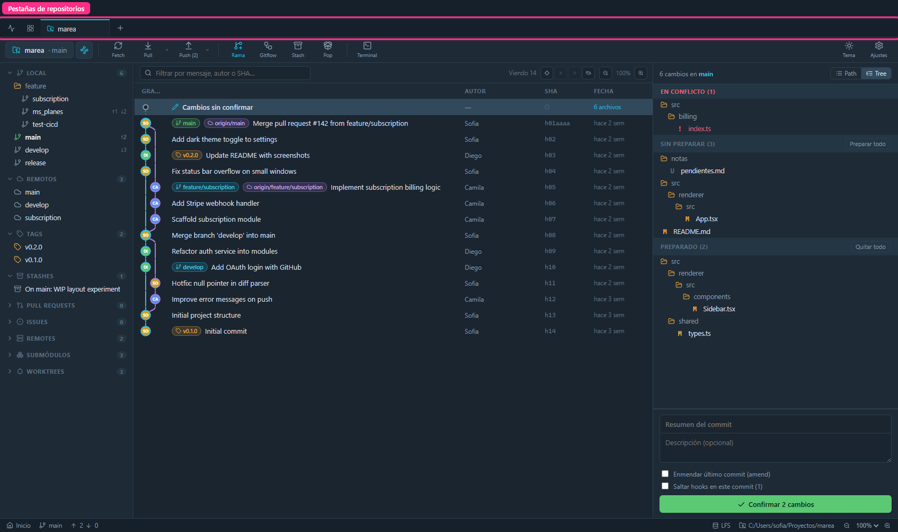

- Cada repositorio abierto es una **pestaña**.
- El **+** (a la derecha) abre otro repositorio.
- **Clic derecho** en una pestaña: **asignar alias**, **copiar ruta** o
  **cerrar**.
- Marea **recuerda** las pestañas abiertas y las restaura la próxima vez que
  abras la aplicación.

---

## 34. Atajos de teclado

Los atajos por defecto (personalizables en *Ajustes → Atajos*):

| Acción | Atajo |
|---|---|
| Fetch | `Ctrl + Shift + F` |
| Pull | `Ctrl + Shift + L` |
| Push | `Ctrl + Shift + P` |
| Nueva rama | `Ctrl + B` |
| Guardar en stash | `Ctrl + Shift + S` |
| Stash pop | `Ctrl + Shift + O` |
| Mostrar/ocultar panel izquierdo | `Ctrl + K` |
| Mostrar/ocultar panel derecho | `Ctrl + J` |
| Mostrar/ocultar terminal | `Ctrl + T` |
| Abrir preferencias | `Ctrl + ,` |
| Acercar / Alejar / Restablecer zoom | `Ctrl + =` / `Ctrl + –` / `Ctrl + 0` |
| Enfocar la búsqueda del grafo | `Ctrl + Alt + F` |

---

## 35. Preguntas frecuentes y solución de problemas

**No me aparecen los Pull Requests / Issues.**
Necesitas sesión en GitHub. Lo más fácil es tener el **Git Credential Manager**
instalado (viene con Git for Windows) y haber hecho al menos un *push* que te
pidiera iniciar sesión. También puedes conectar una cuenta con token en
*Ajustes → Integraciones*.

**Marea dice que no encuentra Git.**
Instala Git (sección 2) y asegúrate de que está en el `PATH`. Si tienes varias
versiones, puedes indicar la ruta exacta del ejecutable en *Ajustes → Git →
Ejecutable Git*.

**Los botones «Deshacer» y «Rehacer» no hacen nada.**
Están **reservados para una versión futura**; de momento no realizan la acción.

**Hice algo sin querer, ¿puedo volver atrás?**
Casi siempre sí. Para deshacer un commit sin perder trabajo usa **Revert**; para
mover la rama usa **Reset (soft/mixed)**. Evita **Reset (hard)** salvo que estés
seguro, porque descarta cambios.

**¿La app modifica mi repositorio sin avisar?**
No. Las acciones destructivas (force push, reset hard, borrar ramas remotas,
eliminar worktrees con cambios…) **piden confirmación** antes de ejecutarse.

---

## 36. Glosario

- **Amend**: modificar el último commit en vez de crear otro.
- **Bisect**: búsqueda por descarte del commit que introdujo un fallo.
- **Blame**: anotación que muestra quién escribió cada línea.
- **Branch (rama)**: línea de trabajo independiente.
- **Cherry-pick**: copiar un commit concreto a tu rama actual.
- **Checkout**: cambiarte a una rama, tag o commit.
- **Clonar**: descargar una copia de un repositorio remoto.
- **Commit**: foto guardada del proyecto con un mensaje.
- **Conflicto**: choque entre dos cambios sobre las mismas líneas.
- **Detached HEAD**: estar «sueltos» en un commit que no es la punta de una rama.
- **Diff**: las diferencias (líneas añadidas/quitadas) entre dos versiones.
- **Fetch**: traer novedades del remoto sin mezclarlas.
- **Fork**: copia propia de un repositorio ajeno.
- **Gitflow**: metodología de ramas feature/release/hotfix.
- **Hook**: script que Git ejecuta solo en ciertos momentos (p. ej. antes de un commit).
- **HEAD**: dónde estás parado ahora mismo.
- **Hunk**: un bloque contiguo de cambios dentro de un diff.
- **Issue**: tarea, error o idea registrada en el proveedor (GitHub…).
- **LFS**: extensión de Git para archivos grandes.
- **Merge**: juntar el trabajo de dos ramas.
- **Pull**: fetch + merge (o rebase).
- **Pull Request (PR)**: propuesta de mezclar una rama, revisable por el equipo.
- **Push**: enviar tus commits al remoto.
- **Rebase**: reaplicar tus commits sobre otra base para ordenar la historia.
- **Remote (remoto)**: copia del repo en un servidor (p. ej. `origin`).
- **Reset**: mover la rama a otro commit (soft/mixed/hard según qué conserva).
- **Revert**: deshacer un commit creando otro que lo anula.
- **Stage (preparar)**: marcar qué cambios entran en el próximo commit.
- **Stash**: cajón temporal para tus cambios sin confirmar.
- **Submódulo**: repositorio de Git anidado dentro de otro.
- **Tag**: etiqueta con nombre sobre un commit (normalmente una versión).
- **Upstream**: la rama remota que sigue tu rama local.
- **Worktree**: carpeta de trabajo adicional del mismo repositorio.

---

<div align="center">

**Marea** 🌊 — Navega tu historial de Git.

</div>
